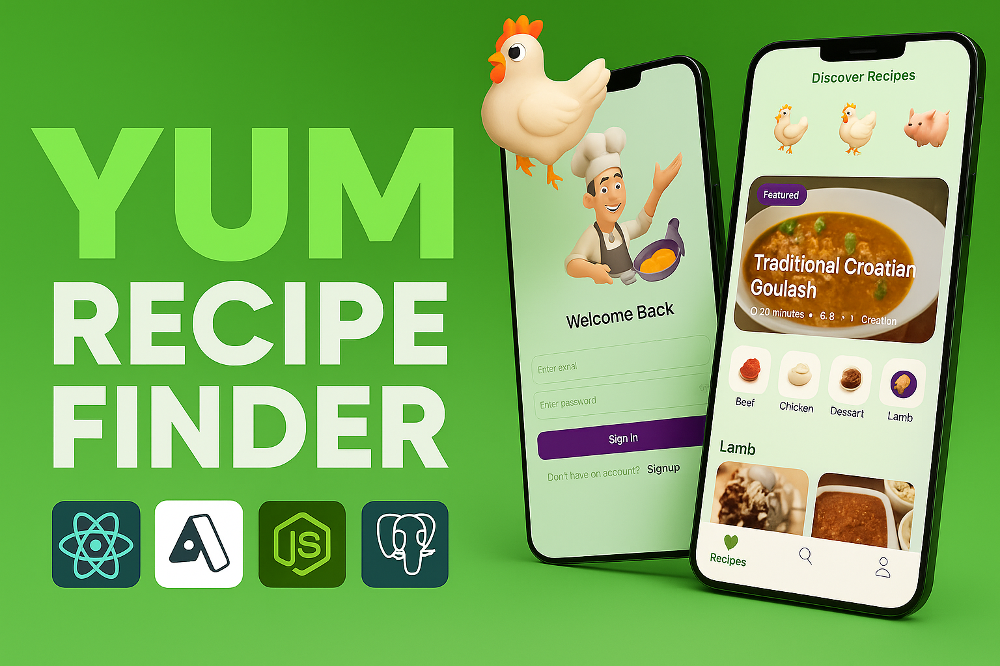
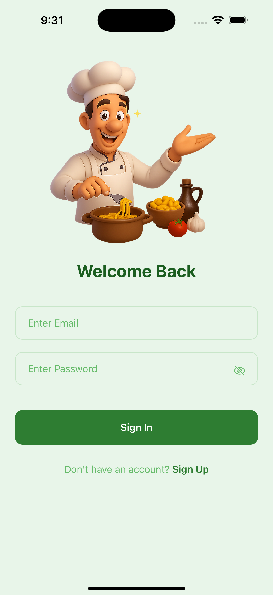
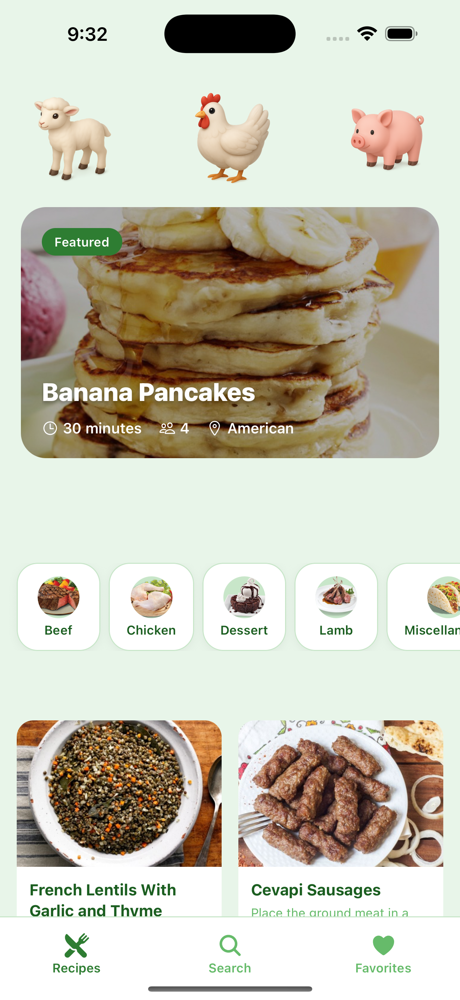
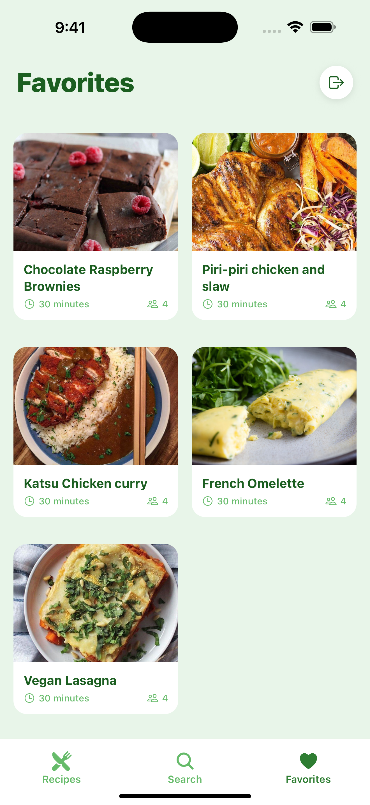

<!-- Top Banner -->
<p align="center">
  
</p>

<!-- App Icon -->
<p align="center">
  
</p>

<h1 align="center">🍃 YUM – Food Recipe Finder App</h1>
<h3 align="center"><i>Discover · Cook · Enjoy</i></h3>

<p align="center">
  
  
  
  
</p>

---

## 📥 **Download the App**

<p align="center">
  <a href="Mobile/apk/application-41e4bcaa-3acc-4d47-98f3-2804a7636b24.apk">
    
  </a>
</p>

---

## ✨ **Features**

🔐 **Secure Auth (Clerk)** – Signup, login, & 6-digit OTP  
🍲 **Global Recipes** – Search, filter & explore cuisines worldwide  
🎬 **Video Tutorials** – Step-by-step cooking with YouTube  
❤️ **Save Favorites** – Smooth UI updates  
⚙️ **Automated Cron Jobs** – Always up-to-date recipes  
✅ **Free & Open Source**

---

## 🎥 **App Preview**

| **Auth Screen** | **Home Screen** | **Recipe Details** | **Favorites** |
|------------------|-----------------|--------------------|---------------|
|  |  |  |  |

---

## 🛠️ **Tech Stack**

<p align="center">
  
  
  
  
  
  
  
</p>

---

## 🚀 **Getting Started**

### ✅ Clone the Repository

```bash
git clone https://github.com/SubhadeepDas-Official/Yum---Food-Recipe-Finder.git
cd Yum---Food-Recipe-Finder
